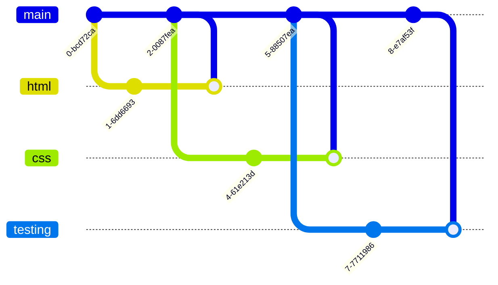
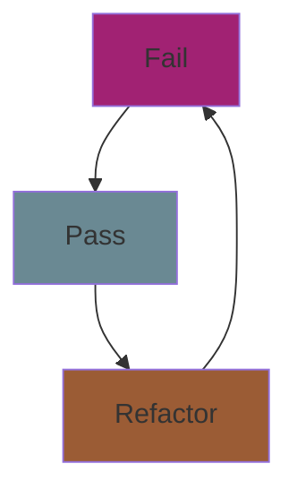

# To-do list

The aim of this project is to build a to-do list tracker, allowing users to create, complete and delete tasks from a list with the intention to practice test-driven development. As a minimum viable product, the app should have the following features:

- A button to **create** a task,
- A button to **delete** a task,
- A checkbox to mark a task as **urgent**,
- A checkbox to mark a task as **completed**,
- A checkbox to **filter** completed tasks.

## _Workflow_

There are 4 branches: **main, html, css, testing**.



## _Website Demo_

<div align=center">


</div>

## _Testing_

Test-driven development is the methodology of writing tests before your code and following an ongoing cycle of **fail, pass, and refactor.** In this section you will find the tests and methods we have used and instructions on how to execute them.

<details>

- Press /button/, enable debug mode,

  ```js
  window.addEventListener("keydown", (event) => {
  ...
  });
  ```

- Press /button/, run test 1,
- Press /button/, run test 2, etc...

</details>

<div align="center">



</div>

## _Project Acceptance Criteria_

- A working to-do list, [
https://github.com/fac26/todo-list--karol-konstantina/issues/8
]
- Tests for each user story, [
https://github.com/fac26/todo-list--karol-konstantina/issues/1 
https://github.com/fac26/todo-list--karol-konstantina/issues/2 
https://github.com/fac26/todo-list--karol-konstantina/issues/3 
https://github.com/fac26/todo-list--karol-konstantina/issues/4 
https://github.com/fac26/todo-list--karol-konstantina/issues/5
]
- A responsive, mobile-first design, [
https://github.com/fac26/todo-list--karol-konstantina/issues/7
]
- Accessible to as many users as possible. [
https://github.com/fac26/todo-list--karol-konstantina/issues/6
]

## _Credits_

This project is being built from the ground up by:

<a href="https://github.com/fac26/todo-list--karol-konstantina/graphs/contributors">
  
</a>
