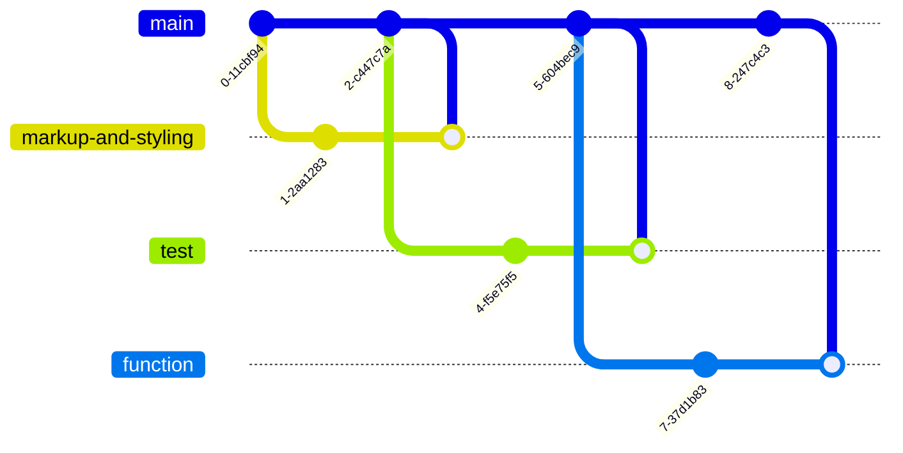
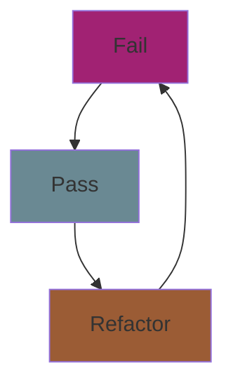

## _Information for Code Review_

- Tests will appear after toggling debug mode using the debug mode button.
- The default action buttons at the bottom do nothing and should be removed later.
- At the moment, only the delete button has full functionality. 
- The edit button has partial functionality
- Github pages might not be deploying properly, so just clone it and deploy locally.

## _To-do list_

The aim of this project is to build a to-do list tracker, allowing users to create, complete and delete tasks from a list with the intention to practice test-driven development. As a minimum viable product, the app should have the following features:

- A button to **create** a task,
- A button to **delete** a task,
- A checkbox to mark a task as **urgent**,
- A checkbox to mark a task as **completed**,
- A checkbox to **filter** completed tasks.

## _Workflow_

There are 4 branches: **main, markup-and-styling, test, and function**.

## _Website Demo_

## _Testing_

Test-driven development is the methodology of writing tests before your code and following an ongoing cycle of **fail, pass, and refactor.** In this section you will find the tests and methods we have used and instructions on how to execute them.

Instructions for testing:

1. Debug button can be toggled with "ESCAPE"
2. Open the console window with "F12"
3. Click the debug button to display tests inside the console.
4. Toggling the debug button or clicking it again will clear the console and any test tasks in the DOM.

## _Project Acceptance Criteria_

- A working to-do list, [
https://github.com/fac26/todo-list--karol-konstantina/issues/8
]
- Tests for each user story, [
https://github.com/fac26/todo-list--karol-konstantina/issues/1 
https://github.com/fac26/todo-list--karol-konstantina/issues/2 
https://github.com/fac26/todo-list--karol-konstantina/issues/3 
https://github.com/fac26/todo-list--karol-konstantina/issues/4 
https://github.com/fac26/todo-list--karol-konstantina/issues/5
]
- A responsive, mobile-first design, [
https://github.com/fac26/todo-list--karol-konstantina/issues/7
]
- Accessible to as many users as possible. [
https://github.com/fac26/todo-list--karol-konstantina/issues/6
]

## _Credits_

This project is being built from the ground up by:

